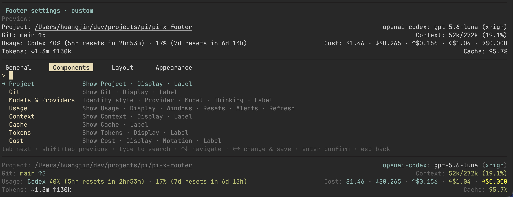
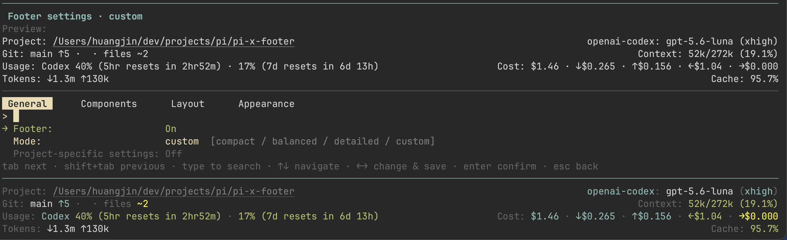
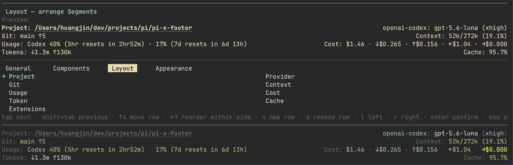
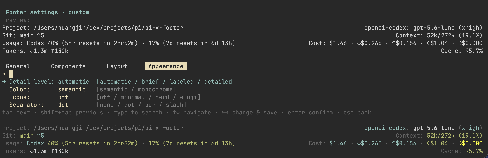

# pi-x-footer

A configurable, information-dense multi-row Footer for Pi.

<p align="center">
  <a href="./assets/main.png"></a>
</p>

## Installation

```bash
pi install git:github.com/jinhuang712/pi-x-footer
```

For reload, local development, and removal, see [INSTALL](./docs/INSTALL.md).

## Features

- Multi-row Footer with independent left/right alignment.
- Responsive fitting for narrow terminals.
- Project, Git branch/status (or a muted no-repository status), provider/model, thinking level, context, tokens, cache, cost, tools, and extension status.
- Cost display presets for total-only, cached/uncached groups, or the full input/output/cache read/cache write breakdown.
- Independent Cost notation with arrows, short labels, or full labels.
- Semantic colors with monochrome fallback.
- Interactive `/xfooter` settings with searchable `General`, `Components`, `Layout`, and `Appearance` tabs.
- Built-in `compact`, `balanced`, `detailed`, and `custom` modes.
- Optional account-level Provider Usage monitoring.
- Footer-only integration through Pi's public Footer API.

`General` contains the global Footer and mode controls:



`Components` contains per-Segment visibility, display, notation, and label controls. The main screenshot above shows the Cost Display and Notation entries alongside the live Footer preview.

`Layout` opens the two-column canvas for arranging Segments:



`Appearance` contains detail level, color, icon, and separator settings:



See [FEATURES](./docs/FEATURES.md) for the capability guide.

## Provider Usage Monitor

| Provider | Provider ID | Usage source |
| --- | --- | --- |
| OpenAI Codex | `openai-codex` | Official ChatGPT usage endpoint |
| OpenCode Go | `opencode-go` | Official OpenCode usage endpoint |
| Volcano Engine Agent Plan | `volcengine-agent-plan` | Official `arkcli` Agent Plan quota |
| Volcano Engine Coding Plan | `volcengine-coding-plan` | Official `arkcli` Coding Plan quota |

Provider Usage is optional, cached, and non-blocking. Unsupported providers, authentication failures, stale data, and network errors do not stop local Footer metrics. The Volcano Engine plans require an authenticated `arkcli` installation:

```bash
npm i -g @volcengine/ark-cli
arkcli auth login volc-sso
```

See [PROVIDERS](./docs/PROVIDERS.md) for matching rules, quota windows, and privacy boundaries.

## Quick start

- `/xfooter` — open settings.
- `/xfooter compact|balanced|detailed` — apply a built-in mode.
- `/xfooter toggle` — enable or disable the Footer.
- `/xfooter refresh` — refresh Provider Usage.
- `/xfooter status` — show non-secret status information.

See [PRESETS](./docs/PRESETS.md) for display modes, Cost breakdowns, and independent Usage settings.

## Documentation

- [INSTALL](./docs/INSTALL.md) — installation and local development.
- [FEATURES](./docs/FEATURES.md) — supported Footer capabilities.
- [PROVIDERS](./docs/PROVIDERS.md) — Provider Usage support and limitations.
- [PRESETS](./docs/PRESETS.md) — built-in modes and independent Usage settings.
- [Configuration and commands](./specs/06-config-commands.md)
- [Settings UI](./specs/12-settings-ui-redesign.md)
- [Layout and rendering](./specs/03-layout-rendering.md)
- [Color themes](./specs/04-color-themes.md)
- [Lifecycle, performance, and security](./specs/07-lifecycle-performance-security.md)

Do not enable `pi-statusline` or `pi-powerline-footer` at the same time; they also replace Pi's Footer.

## License

MIT. See [LICENSE](./LICENSE) and [NOTICE.md](./NOTICE.md).
